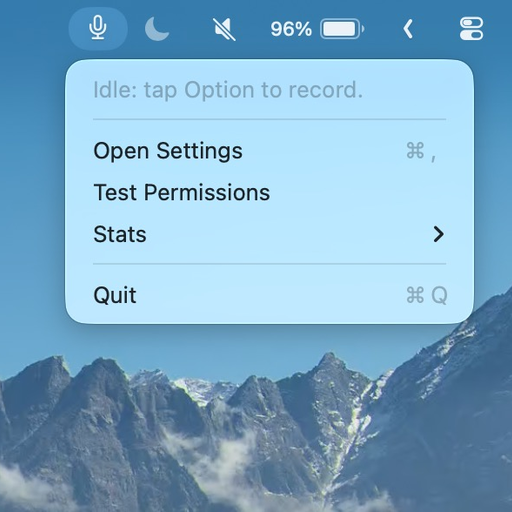

<p align="center">
  
</p>

<h1 align="center">Groq MenuBar Dictate</h1>

<p align="center">
  A tiny macOS menu bar app for fast speech-to-text with Groq.
</p>

Groq MenuBar Dictate is built for the moment when typing would slow you down.
Tap Option, say what you want to write, tap Option again, and the transcript is copied or pasted into the app you were already using.

It is intentionally small: no heavy window, no account system, no background dashboard.
Just quick dictation from the menu bar.

## Highlights

- Tap Option once to start recording, then tap Option again to stop.
- Transcribe with Groq's `whisper-large-v3-turbo` model by default.
- Copy the transcript to your clipboard and optionally auto-paste it with Cmd+V.
- Add custom words so names, projects, and uncommon terms are spelled better.
- Trim unwanted filler words or trailing phrases before the text is pasted.
- Choose whether either Option key, left Option, or right Option starts recording.
- Runs as a native AppKit menu bar app and stays lightweight when idle.

## Requirements

- macOS 13 or newer
- Swift 6.2 or newer
- A Groq API key

## Quick Start

Clone the repo and launch it from source:

```bash
git clone https://github.com/ht0324/groq-menubar-dictate.git
cd groq-menubar-dictate
swift run
```

Open the menu bar item, choose `Open Settings`, and paste in your Groq API key.
The app will ask for the macOS permissions it needs the first time you use the relevant feature.

## How To Use

1. Tap Option once to begin recording.
2. Speak naturally.
3. Tap Option again to stop recording.
4. Wait a moment for transcription.
5. Use the pasted text, or grab it from the clipboard if auto-paste is disabled.

Press Escape while recording to cancel the current recording without transcribing it.
The menu bar icon is for settings and status; recording is controlled from the keyboard.

## Install To Applications

For everyday use, install the app bundle into `/Applications`:

```bash
./scripts/create_local_signing_identity.sh
./scripts/install_to_applications.sh
open -a "/Applications/Groq MenuBar Dictate.app"
```

The local signing identity is self-signed and only for this Mac, but it keeps the app identity stable so macOS is less likely to ask for Accessibility/Input Monitoring again after every reinstall. If you have an Apple code-signing certificate, the installer will prefer that stable identity instead:

```bash
security find-identity -v -p codesigning
GROQ_DICTATE_SIGN_IDENTITY="Apple Development: Your Name (TEAMID)" ./scripts/install_to_applications.sh
```

You can also match an installed identity by hint:

```bash
GROQ_DICTATE_SIGN_IDENTITY_HINT="you@example.com" ./scripts/install_to_applications.sh
```

Ad-hoc signing is still available for one-off local builds, but it may reset macOS permissions after updates:

```bash
GROQ_DICTATE_ALLOW_ADHOC=1 ./scripts/install_to_applications.sh
```

## Settings And Text Cleanup

The Settings window lets you configure:

- Groq API key
- Transcription model
- Optional language hint
- Auto-paste behavior
- Launch at login
- Microphone input mode
- Option key trigger mode
- Recording tap timing
- Maximum audio size
- End-of-transcript pruning

You can also edit local text files for cleanup rules:

- Custom words: `~/Library/Application Support/groq-menubar-dictate/custom-words.txt`
- Filter words: `~/Library/Application Support/groq-menubar-dictate/filter-words.txt`
- End prune phrases: `~/Library/Application Support/groq-menubar-dictate/end-prune-phrases.txt`

Custom words are added to the transcription prompt.
Filter words remove matching text chunks case-insensitively.
End prune phrases trim common trailing signoffs such as `thank you` or `thanks for watching`.

## Permissions

macOS may ask for:

- Microphone access, so the app can record short audio clips.
- Input Monitoring, so it can detect the global Option key tap.
- Permission to post keyboard events, so auto-paste can send Cmd+V.

Use the `Test Permissions` menu item to check what is still missing.
If a permission is missing, transcription can still copy to the clipboard, but the related feature may be unavailable.

## Privacy And Local Data

- Your Groq API key is stored locally in app settings through `UserDefaults`.
- Audio is recorded to temporary `.m4a` files before upload to Groq for transcription.
- Startup cleanup removes stale `dictation-*.m4a` temp files older than 24 hours.
- Personal cleanup files live in `~/Library/Application Support/groq-menubar-dictate/`.
- Do not commit API keys or personal cleanup files to the repository.

## Development

Run these commands from the repository root:

```bash
swift build
swift test
swift test --filter OptionTapValidatorTests
swift run
```

The code is organized around small services:

- `AppCoordinator.swift` owns the record, transcribe, copy, and paste flow.
- `AudioRecorderService.swift` records temporary audio clips.
- `GroqTranscriptionService.swift` sends audio to Groq.
- `PermissionService.swift` checks the macOS permissions.
- `*Store` types persist settings, text cleanup rules, and stats.

Tests live in `Tests/GroqMenuBarDictateTests/` and avoid real microphone or network dependencies.

## Performance Snapshot

On a MacBook M1 Pro during local testing:

- CPU is usually near `0.0%` when idle.
- Memory is roughly `23 MB` in `top` and about `62.5 MB` RSS in `ps`.
- The app is designed to stay quiet during idle time and quick dictation bursts.
