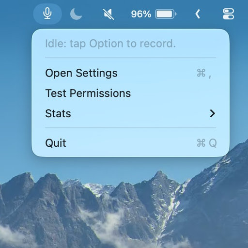

<p align="center">
  
</p>

<h1 align="center">Bolt</h1>

<p align="center">
  A macOS menu bar app for dictating text with Groq.
</p>

An ultra fast lightweight super awesome dictation app that I made. This is the app that literally gives me joy every time I use it because it is so fast.

It stays in the menu bar until you need it.

## What it does

- Uses Groq's `whisper-large-v3-turbo` model by default.
- Copies every transcript to the clipboard and can paste it automatically with Cmd+V.
- Adds project names and uncommon terms to the transcription prompt through a custom words file.
- Removes unwanted filler and trailing phrases before pasting.
- Lets you use either Option key or reserve the shortcut for the left or right key.

## Quick start

Building from source requires macOS 13 or newer, Swift 6.2 or newer, and a Groq API key.

```bash
git clone https://github.com/ht0324/groq-menubar-dictate.git
cd groq-menubar-dictate
swift run Bolt
```

Open the menu bar item, choose `Open Settings`, and paste in your Groq API key. macOS will ask for the permissions needed by each feature the first time you use it.

## Using Bolt

Tap Option once to start recording and again to stop. After Groq returns the transcript, Bolt copies it to the clipboard and pastes it if auto-paste is enabled.

Press Escape while recording to cancel without sending the audio for transcription. The menu bar item is for status and settings; recording is controlled from the keyboard.

## Settings and text cleanup

The Settings window controls the Groq model and language hint, auto-paste, launch at login, microphone input, Option key choice, tap timing, maximum audio size, and end-of-transcript pruning.

Bolt also reads three local files for words and cleanup rules:

| File | What it does |
| --- | --- |
| `~/Library/Application Support/groq-menubar-dictate/custom-words.txt` | Adds names and uncommon terms to the transcription prompt. |
| `~/Library/Application Support/groq-menubar-dictate/filter-words.txt` | Removes matching text chunks case-insensitively. |
| `~/Library/Application Support/groq-menubar-dictate/end-prune-phrases.txt` | Trims trailing phrases such as `thank you` or `thanks for watching`. |

## Permissions and privacy

Bolt may ask for microphone access to record audio, Input Monitoring to detect the global Option and Escape keys, and permission to post keyboard events for Cmd+V.

Use `Test Permissions` from the menu bar if a shortcut or auto-paste is not working. A transcript is still copied to the clipboard when auto-paste is unavailable.

The Groq API key is stored locally in `UserDefaults`. Recordings are written to temporary `.m4a` files and sent to Groq for transcription. Bolt removes stale `dictation-*.m4a` files older than 24 hours when it starts. Personal cleanup files stay in `~/Library/Application Support/groq-menubar-dictate/` and should not be committed.

## Install in Applications

On a new Mac, create the local signing identity once, then install Bolt:

```bash
./scripts/create_local_signing_identity.sh
./scripts/install_to_applications.sh
open -a "/Applications/Bolt.app"
```

Later reinstalls only need `./scripts/install_to_applications.sh`. The stable identity helps macOS retain Accessibility and Input Monitoring permissions between builds. The installer prefers an Apple code-signing identity when one is available, then falls back to the local identity.

<details>
<summary>Signing and release details</summary>

List the available Apple signing identities and select one explicitly:

```bash
security find-identity -v -p codesigning
GROQ_DICTATE_SIGN_IDENTITY="Apple Development: Your Name (TEAMID)" ./scripts/install_to_applications.sh
```

You can also match an identity by hint:

```bash
GROQ_DICTATE_SIGN_IDENTITY_HINT="you@example.com" ./scripts/install_to_applications.sh
```

Ad-hoc signing works for one-off builds, but it may reset macOS permissions after an update:

```bash
GROQ_DICTATE_ALLOW_ADHOC=1 ./scripts/install_to_applications.sh
```

Each installed bundle includes its git-derived version, commit count, commit SHA, branch, worktree state, and build date. To make a shareable zip with the local signing identity:

```bash
./scripts/export_release_zip.sh
```

The zip is written to `dist/` with the version, build number, commit, and worktree state in its filename.

</details>

## Development

Run these commands from the repository root:

```bash
swift build
swift test
swift test --filter OptionTapValidatorTests
swift run Bolt
```

`AppCoordinator.swift` owns the record, transcribe, copy, and paste flow. Audio capture, Groq requests, and permission checks live in separate `*Service` types, while `*Store` types handle settings, cleanup rules, and stats.

Tests live in `Tests/GroqMenuBarDictateTests/` and avoid real microphone or network dependencies.
